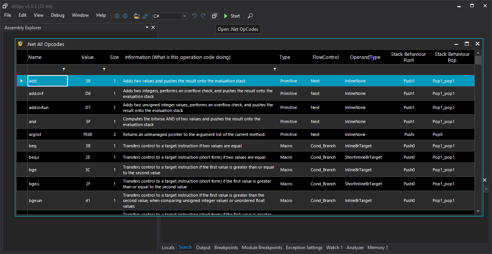

# MyOpCodeTable
A Handy Tool to view MSIL Opcodes List, DnSpy Extention and Standalone Application

Installation : just paste the dnSpy_MyOpCodeTable.zip to dnSpy/bin folder then open the application. it will be open MyOpCodeTable in completely separate thread though it won't block main application from working.

  

